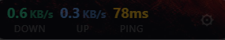

# NetTracker

A lightweight, always-on-top network monitor for Windows. Sits as a compact transparent bar on your desktop showing real-time network statistics.



---

## Features

- Real-time download and upload speed
- Ping monitor (ICMP to 8.8.8.8)
- Active connections count
- Session data usage (total downloaded / uploaded)
- 4 built-in themes: Glassmorphism, Tokyo Night, Iron Man, Pac-Man
- Draggable, frameless, always-on-top window
- Hidden from taskbar
- Configurable refresh rate (0.5s, 1s, 2s)
- Adjustable opacity
- Toggle which stats are visible
- Settings persist across sessions
- Single instance enforcement
- Start with Windows support

---

## Preview

The bar auto-sizes based on which stats are enabled. Settings open in the same window on click of the gear icon. Use the power button inside settings to quit.

---

## Tech Stack

| Layer | Technology |
|---|---|
| Framework | Wails v2 |
| Backend | Go 1.26 |
| Frontend | React 18 + Vite |
| Network Stats | gopsutil v3 |
| Styling | Plain CSS with CSS variables |
| Build Output | Single `.exe`, ~10MB |

---

## Download

## Download

Download the latest release: [NetTracker v1.0.0](https://github.com/ayushcmd/nettracker/releases/tag/v1.0.0)

Direct download: [nettracker.exe](https://github.com/ayushcmd/nettracker/releases/latest/download/nettracker.exe)

No installer required — just double-click to run. Requires Windows 10/11.

---

## Run Locally

**Prerequisites**

- Go 1.20+
- Node.js 18+
- Wails CLI v2

**Install Wails**

```bash
go install github.com/wailsapp/wails/v2/cmd/wails@latest
```

**Clone and run in dev mode**

```bash
git clone https://github.com/ayushcmd/nettracker
cd nettracker
wails dev
```

**Build production `.exe`**

```bash
wails build -platform windows/amd64 -ldflags "-H windowsgui"
```

Output: `build/bin/nettracker.exe`

---

## Usage

- **Drag** the bar anywhere on screen
- **Gear icon** opens settings
- **Settings > Display** — toggle which stats appear on the bar
- **Settings > Theme** — switch between 4 themes
- **Settings > Opacity** — adjust transparency
- **Settings > Refresh Rate** — control update frequency
- **Power button** in settings — quit the app

---

## Project Structure

```
nettracker/
├── main.go                          # App entry, Wails config
├── app.go                           # Backend logic, network stats, Go bindings
├── build/
│   └── windows/
│       ├── icon.ico
│       └── app.manifest
└── frontend/
    └── src/
        ├── App.jsx                  # Main bar component
        ├── App.css                  # Styles
        ├── themes.js                # Theme definitions
        └── components/
            └── SettingsPanel.jsx    # Settings UI
```

---

## License

MIT License — free to use, modify, and distribute.

```
Copyright (c) 2026 Ayush Raj

Permission is hereby granted, free of charge, to any person obtaining a copy
of this software and associated documentation files (the "Software"), to deal
in the Software without restriction, including without limitation the rights
to use, copy, modify, merge, publish, distribute, sublicense, and/or sell
copies of the Software, and to permit persons to whom the Software is
furnished to do so, subject to the following conditions:

The above copyright notice and this permission notice shall be included in all
copies or substantial portions of the Software.

THE SOFTWARE IS PROVIDED "AS IS", WITHOUT WARRANTY OF ANY KIND, EXPRESS OR
IMPLIED, INCLUDING BUT NOT LIMITED TO THE WARRANTIES OF MERCHANTABILITY,
FITNESS FOR A PARTICULAR PURPOSE AND NONINFRINGEMENT. IN NO EVENT SHALL THE
AUTHORS OR COPYRIGHT HOLDERS BE LIABLE FOR ANY CLAIM, DAMAGES OR OTHER
LIABILITY, WHETHER IN AN ACTION OF CONTRACT, TORT OR OTHERWISE, ARISING FROM,
OUT OF OR IN CONNECTION WITH THE SOFTWARE OR THE USE OR OTHER DEALINGS IN THE
SOFTWARE.
```

---

Built by [Ayush Raj](https://github.com/ayushcmd) 
